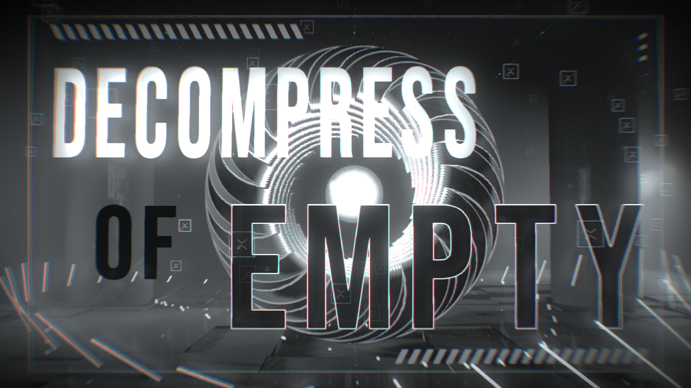

# Decompress of Empty

実行できるページはこのあとどっかあげます

Sessions PC64K Intro



## Install

以下の実行ファイルをPATHに追加してください。

[JsExe](https://www.pouet.net/prod.php?which=59298)  
[Shader_Minifier](https://github.com/laurentlb/Shader_Minifier)

```
npm install
```

## Run

```
npm run dev
```